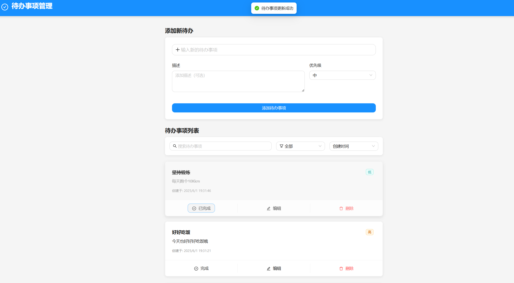

# FastAPI-React Todo 应用


一个功能完善的待办事项（Todo）应用，采用 FastAPI 和 React 技术栈构建，支持待办事项的创建、编辑、删除、标记完成等功能。

## 📋 功能特点

- ✅ 创建、编辑、删除和管理待办事项
- 🔍 按关键词搜索待办事项
- 🔄 按状态（已完成/未完成）筛选待办事项
- 📊 按优先级、创建时间或字母顺序排序
- 🌈 优先级标签颜色区分（从低到高）
- 📱 响应式设计，适配各种屏幕尺寸

## 😎 页面预览



## 🛠️ 技术栈

### 后端

- **FastAPI**: 高性能的现代 Python Web 框架
- **SQLModel**: 结合了 SQLAlchemy 和 Pydantic 的 ORM 库
- **Uvicorn**: ASGI 服务器
- **SQLite**: 轻量级数据库

### 前端

- **React**: 用于构建用户界面的 JavaScript 库
- **TypeScript**: JavaScript 的超集，提供类型检查
- **Ant Design**: 企业级 UI 设计语言和 React 组件库
- **Vite**: 现代前端构建工具

## 🚀 快速开始

### 系统要求

- Python 3.8+
- Node.js 16+
- npm 或 yarn

### 安装步骤

#### 1. 克隆仓库

```bash
git clone https://github.com/chan1919/fastapi-react-todo.git
cd fastapi-react-todo
```

#### 2. 后端设置

```bash
# 创建并激活虚拟环境（可选但推荐）
python -m venv venv
source venv/bin/activate  # 在 Windows 上使用: venv\Scripts\activate

# 安装依赖
pip install fastapi uvicorn sqlmodel

# 启动后端服务器
cd backend
python main.py
```

后端服务器将在 http://localhost:8000 上运行。
API 文档可在 http://localhost:8000/docs 查看。

#### 3. 前端设置

```bash
# 安装依赖
cd frontend
npm install  # 或者使用 yarn: yarn install

# 启动开发服务器
npm run dev  # 或者使用 yarn: yarn dev
```

前端应用将在 http://localhost:5173 上运行。

## 📝 项目结构

```
fastapi-react/
├── backend/                # 后端代码
│   ├── app/
│   │   ├── database/       # 数据库配置
│   │   ├── models/         # 数据模型
│   │   ├── routers/        # API 路由
│   │   ├── services/       # 业务逻辑
│   │   └── main.py         # FastAPI 应用
│   └── main.py             # 入口文件
└── frontend/               # 前端代码
    ├── public/             # 静态资源
    └── src/
        ├── api/            # API 客户端
        ├── components/     # React 组件
        ├── context/        # React 上下文
        ├── layouts/        # 布局组件
        └── types/          # TypeScript 类型定义

```

## 🔄 API 端点

| 方法   | 端点       | 描述             |
| ------ | ---------- | ---------------- |
| GET    | /todo      | 获取所有待办事项 |
| GET    | /todo/{id} | 获取单个待办事项 |
| POST   | /todo      | 创建新的待办事项 |
| PUT    | /todo/{id} | 更新待办事项     |
| DELETE | /todo/{id} | 删除待办事项     |

## 🤝 贡献

欢迎贡献代码、报告问题或提出改进建议！请随时提交 Pull Request 或创建 Issue。

## 📄 许可证

本项目采用 [MIT 许可证](LICENSE)。

## 📞 联系方式

如有任何问题或建议，请通过以下方式联系我：

- GitHub: [chan1919](https://github.com/chan1919)
- @X: [ suoni](https://x.com/czyncu)
- 邮箱: suoni1919@gmail.com

---

[](https://github.com/chan1919/fastapi-react-todo)
