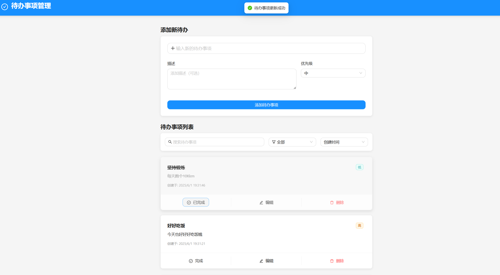

# FastAPI-React Todo 应用 - 完整教学指南


一个功能完善的待办事项（Todo）应用，采用 **FastAPI + React** 技术栈构建。本项目专为初学者设计，帮助你从零开始理解现代 Web 开发的核心概念。

---

## 📚 目录

1. [项目简介](#-项目简介)
2. [项目架构详解](#-项目架构详解)
3. [技术选型理由](#-技术选型理由)
4. [核心概念解释](#-核心概念解释)
5. [快速开始](#-快速开始)
6. [详细环境配置](#-详细环境配置)
7. [常见问题FAQ](#-常见问题faq)
8. [扩展学习资源](#-扩展学习资源)
9. [项目结构](#-项目结构)
10. [联系方式](#-联系方式)

---

## 🎯 项目简介

这是一个全功能的待办事项管理应用，你可以用它：

- ✅ 创建、编辑、删除和管理待办事项
- 🔍 按关键词搜索待办事项
- 🔄 按状态（已完成/未完成）筛选待办事项
- 📊 按优先级、创建时间或字母顺序排序
- 🌈 优先级标签颜色区分（从低到高）
- 📱 响应式设计，适配各种屏幕尺寸

### 😎 页面预览



---

## 🏗️ 项目架构详解

### 前后端分离架构

```
┌─────────────────────────────────────────────────────────────┐
│                         客户端                               │
│                    (浏览器/移动设备)                          │
└──────────────────────┬──────────────────────────────────────┘
                       │ HTTP/HTTPS
                       ▼
┌─────────────────────────────────────────────────────────────┐
│                      前端层 (Frontend)                        │
│  ┌─────────────┐  ┌─────────────┐  ┌─────────────────────┐  │
│  │   React     │  │ TypeScript  │  │    Ant Design       │  │
│  │  UI组件库   │  │  类型检查   │  │    UI组件库         │  │
│  └─────────────┘  └─────────────┘  └─────────────────────┘  │
│                         │                                   │
│  ┌─────────────┐  ┌─────────────┐  ┌─────────────────────┐  │
│  │   Context   │  │  todoApi.ts │  │      Vite           │  │
│  │  状态管理   │  │  API调用层  │  │    构建工具         │  │
│  └─────────────┘  └─────────────┘  └─────────────────────┘  │
└──────────────────────┬──────────────────────────────────────┘
                       │ JSON REST API
                       ▼
┌─────────────────────────────────────────────────────────────┐
│                      后端层 (Backend)                         │
│  ┌─────────────┐  ┌─────────────┐  ┌─────────────────────┐  │
│  │   FastAPI   │  │   Pydantic  │  │    SQLModel         │  │
│  │  Web框架    │  │  数据验证   │  │    ORM数据库        │  │
│  └─────────────┘  └─────────────┘  └─────────────────────┘  │
│                         │                                   │
│  ┌─────────────┐  ┌─────────────┐  ┌─────────────────────┐  │
│  │    SQLite   │  │   Uvicorn   │  │   CORSMiddleware    │  │
│  │   数据库    │  │  ASGI服务器 │  │    跨域处理         │  │
│  └─────────────┘  └─────────────┘  └─────────────────────┘  │
└─────────────────────────────────────────────────────────────┘
```

### 数据流向图

```
用户操作 → React组件 → Context状态管理 → API调用层
                                              ↓
UI更新 ← 状态重新渲染 ← 数据返回处理 ← FastAPI后端
         ↑                                    ↓
      展示数据                          数据库CRUD操作
```

---

## 💡 技术选型理由

### 为什么选择 FastAPI？

| 特性 | 说明 |
|------|------|
| **高性能** | 基于 Starlette 和 Pydantic，性能接近 Node.js 和 Go |
| **自动文档** | 自动生成 Swagger UI 和 ReDoc 交互式 API 文档 |
| **类型提示** | 原生支持 Python 类型提示，减少运行时错误 |
| **数据验证** | 使用 Pydantic 自动进行请求/响应数据验证 |
| **异步支持** | 原生支持 async/await，处理并发更高效 |
| **易学易用** | 学习曲线平缓，适合初学者快速上手 |

### 为什么选择 React？

| 特性 | 说明 |
|------|------|
| **组件化** | 将 UI 拆分为独立、可复用的组件 |
| **虚拟 DOM** | 高效的 DOM 更新机制，提升性能 |
| **生态丰富** | 庞大的社区和丰富的第三方库 |
| **灵活性强** | 可以与其他库自由组合使用 |
| **就业市场** | 目前最流行的前端框架之一 |

### 为什么选择 TypeScript？

| 特性 | 说明 |
|------|------|
| **类型安全** | 在编译时捕获潜在错误 |
| **智能提示** | IDE 提供更好的代码补全和导航 |
| **可维护性** | 大型项目的代码更易维护 |
| **文档化** | 类型定义就是最好的文档 |
| **团队协作** | 提高多人协作的效率 |

### 为什么选择 SQLModel？

SQLModel 是一个结合了 **SQLAlchemy**（强大的 ORM）和 **Pydantic**（数据验证）的库：

- 一次定义，多处使用（数据库模型 + API 数据模型）
- 自动数据验证
- 减少重复代码

---

## 📖 核心概念解释

### 1. REST API

REST（Representational State Transfer）是一种设计网络应用程序的架构风格。

**核心原则：**
- **资源**：一切皆资源（如 `/todo` 表示待办事项资源）
- **HTTP 方法**：使用标准 HTTP 方法操作资源
  - `GET`：获取资源
  - `POST`：创建资源
  - `PUT`：更新资源
  - `DELETE`：删除资源
- **无状态**：每个请求都是独立的，服务器不保存客户端状态

**示例：**
```
GET    /todo       → 获取所有待办事项
GET    /todo/1     → 获取 ID 为 1 的待办事项
POST   /todo       → 创建新待办事项
PUT    /todo/1     → 更新 ID 为 1 的待办事项
DELETE /todo/1     → 删除 ID 为 1 的待办事项
```

### 2. ORM（对象关系映射）

ORM 让你可以用面向对象的方式操作数据库，而不需要写 SQL。

**传统方式（SQL）：**
```sql
SELECT * FROM todo WHERE id = 1;
INSERT INTO todo (item, priority) VALUES ('学习', 1);
```

**ORM 方式（SQLModel）：**
```python
# 查询
todo = session.get(Todo, 1)

# 创建
new_todo = Todo(item="学习", priority=1)
session.add(new_todo)
session.commit()
```

**优点：**
- 代码更简洁、可读性更好
- 数据库无关（切换数据库更容易）
- 防止 SQL 注入攻击
- 类型安全

### 3. React Context（上下文）

Context 提供了一种在组件之间共享数据的方式，而不需要通过 props 逐层传递。

**为什么需要 Context？**

不使用 Context（Props Drilling）：
```
App → Layout → Header → UserMenu → UserAvatar
每层都要传递 user 数据
```

使用 Context：
```
任何组件都可以直接访问共享的数据
```

**本项目的 Context 用途：**
- 存储待办事项列表
- 管理加载状态
- 提供增删改查的方法
- 统一管理错误处理

### 4. CORS（跨域资源共享）

浏览器出于安全考虑，默认禁止网页向不同域的服务器发送请求。

**场景：**
- 前端运行在 `http://localhost:5173`
- 后端运行在 `http://localhost:8000`
- 这是两个不同的端口，浏览器认为是"跨域"

**解决方案：**
后端配置 CORS，允许特定的前端域名访问：
```python
app.add_middleware(
    CORSMiddleware,
    allow_origins=["http://localhost:5173"],
    allow_credentials=True,
    allow_methods=["*"],
    allow_headers=["*"],
)
```

### 5. 虚拟环境与依赖管理

**为什么需要虚拟环境？**
- 隔离项目依赖（不同项目可能需要不同版本的库）
- 避免污染系统 Python 环境
- 方便部署和分享

**Python 虚拟环境：**
```bash
# 创建虚拟环境
python -m venv venv

# Windows 激活
venv\Scripts\activate

# macOS/Linux 激活
source venv/bin/activate
```

**Node.js 依赖：**
```bash
# package.json 记录项目依赖
npm install  # 根据 package.json 安装所有依赖
```

---

## 🚀 快速开始

### 系统要求

| 软件 | 最低版本 | 下载链接 |
|------|---------|---------|
| Python | 3.8+ | [python.org](https://www.python.org/downloads/) |
| Node.js | 16+ | [nodejs.org](https://nodejs.org/) |
| Git | 任意版本 | [git-scm.com](https://git-scm.com/) |

### 一键启动（推荐）

#### 1. 克隆仓库

```bash
git clone https://github.com/chan1919/fastapi-react-todo.git
cd fastapi-react-todo
```

#### 2. 启动后端

```bash
cd backend

# 创建虚拟环境（首次运行）
python -m venv venv

# Windows 激活虚拟环境
venv\Scripts\activate

# 安装依赖（首次运行）
pip install -r requirements.txt

# 启动服务器
python main.py
```

后端将在 http://localhost:8000 运行  
API 文档：http://localhost:8000/docs

#### 3. 启动前端（新开终端）

```bash
cd frontend

# 安装依赖（首次运行）
npm install

# 启动开发服务器
npm run dev
```

前端将在 http://localhost:5173 运行

#### 4. 访问应用

打开浏览器访问 http://localhost:5173，开始使用！

---

## ⚙️ 详细环境配置

### Windows 环境配置

#### Python 安装与配置

1. **下载 Python**
   - 访问 [python.org](https://www.python.org/downloads/windows/)
   - 下载 Python 3.10 或更高版本
   - **重要**：安装时勾选 "Add Python to PATH"

2. **验证安装**
   ```cmd
   python --version
   pip --version
   ```

3. **配置 pip 镜像（加速下载）**
   ```cmd
   pip config set global.index-url https://pypi.tuna.tsinghua.edu.cn/simple
   ```

#### Node.js 安装与配置

1. **下载 Node.js**
   - 访问 [nodejs.org](https://nodejs.org/)
   - 下载 LTS（长期支持）版本
   - 按向导完成安装

2. **验证安装**
   ```cmd
   node --version
   npm --version
   ```

3. **配置 npm 镜像（加速下载）**
   ```cmd
   npm config set registry https://registry.npmmirror.com
   ```

### macOS 环境配置

#### 使用 Homebrew 安装

```bash
# 安装 Homebrew（如果还没有）
/bin/bash -c "$(curl -fsSL https://raw.githubusercontent.com/Homebrew/install/HEAD/install.sh)"

# 安装 Python
brew install python@3.10

# 安装 Node.js
brew install node@18
```

### Linux 环境配置

#### Ubuntu/Debian

```bash
# 安装 Python
sudo apt update
sudo apt install python3 python3-pip python3-venv -y

# 安装 Node.js
curl -fsSL https://deb.nodesource.com/setup_18.x | sudo -E bash -
sudo apt install -y nodejs
```

---

## ❓ 常见问题 FAQ

### Q1: 后端启动报错 "ModuleNotFoundError"

**问题原因**：没有安装依赖或虚拟环境未激活

**解决方法**：
```bash
cd backend
venv\Scripts\activate  # Windows
pip install -r requirements.txt
python main.py
```

### Q2: 前端无法连接后端，控制台显示 CORS 错误

**问题原因**：前后端通信被浏览器拦截

**解决方法**：
1. 确认后端已启动并运行在 http://localhost:8000
2. 检查后端 `main.py` 中的 `origins` 列表包含前端地址
3. 重启后端服务

### Q3: npm install 卡住或失败

**问题原因**：网络问题或 npm 源不稳定

**解决方法**：
```bash
# 使用淘宝镜像
npm config set registry https://registry.npmmirror.com

# 清除缓存后重试
npm cache clean --force
rm -rf node_modules
npm install
```

### Q4: Python 虚拟环境激活失败

**问题原因**：PowerShell 执行策略限制

**解决方法**：
```powershell
# 以管理员身份运行 PowerShell
Set-ExecutionPolicy -ExecutionPolicy RemoteSigned -Scope CurrentUser

# 然后再次尝试激活
venv\Scripts\activate
```

### Q5: 数据库文件在哪里？如何重置？

**位置**：`backend/app/database/todos.db`

**重置方法**：
```bash
# 停止后端服务器
cd backend/app/database
rm todos.db  # 删除数据库文件

# 重新启动后端，会自动创建新数据库
python main.py
```

### Q6: 如何修改后端端口？

编辑 `backend/main.py`：
```python
# 找到这一行
uvicorn.run(app, host="127.0.0.1", port=8000)
# 修改为其他端口，如 8080
uvicorn.run(app, host="127.0.0.1", port=8080)
```

同时更新前端的 API 地址配置。

### Q7: TypeScript 类型错误如何解决？

**常见情况**：属性名不匹配（驼峰 vs 蛇形命名）

**本项目已处理**：`todoApi.ts` 中已包含 `snakeToCamel` 和 `camelToSnake` 转换函数，自动处理命名格式差异。

---

## 📚 扩展学习资源

### FastAPI 学习路径

1. **官方文档**：[fastapi.tiangolo.com](https://fastapi.tiangolo.com/)
2. **中文教程**：[FastAPI 中文网](https://fastapi.qubitpi.org/)
3. **推荐书籍**：《FastAPI 现代 Python Web 开发》

**进阶主题：**
- 用户认证与授权（JWT）
- 数据库迁移（Alembic）
- 测试（pytest）
- 部署（Docker、云服务器）

### React 学习路径

1. **官方文档**：[react.dev](https://react.dev/)
2. **中文教程**：[React 入门教程](https://zh-hans.react.dev/learn)
3. **推荐课程**：Scrimba 的 React 免费课程

**进阶主题：**
- React Router（路由管理）
- Redux/Zustand（状态管理）
- React Query（数据获取）
- Next.js（全栈框架）

### TypeScript 学习资源

1. **官方文档**：[typescriptlang.org](https://www.typescriptlang.org/)
2. **在线练习**：[TypeScript Playground](https://www.typescriptlang.org/play)
3. **推荐书籍**：《TypeScript 编程》

### SQLModel & SQLAlchemy

1. **SQLModel 官方文档**：[sqlmodel.tiangolo.com](https://sqlmodel.tiangolo.com/)
2. **SQLAlchemy 文档**：[docs.sqlalchemy.org](https://docs.sqlalchemy.org/)

### 前端 UI 设计

1. **Ant Design 文档**：[ant.design](https://ant.design/)
2. **Flexbox 布局指南**：[CSS Tricks Flexbox](https://css-tricks.com/snippets/css/a-guide-to-flexbox/)
3. **配色工具**：[Coolors](https://coolors.co/)

### 部署相关

1. **Docker 入门**：[Docker 官方教程](https://docs.docker.com/get-started/)
2. **Nginx 配置**：[Nginx 入门指南](https://nginx.org/en/docs/beginners_guide.html)
3. **云服务**：AWS、阿里云、腾讯云等

---

## 📁 项目结构

```
fastapi-react-todo/
├── 📂 backend/                 # 后端代码
│   ├── 📂 app/
│   │   ├── 📂 database/        # 数据库配置
│   │   │   ├── __init__.py
│   │   │   └── database.py     # 数据库引擎和会话管理
│   │   ├── 📂 models/          # 数据模型（SQLModel）
│   │   │   ├── __init__.py
│   │   │   └── todo.py         # Todo 模型定义
│   │   ├── 📂 routers/         # API 路由
│   │   │   ├── __init__.py
│   │   │   └── todo.py         # Todo 路由处理器
│   │   ├── 📂 services/        # 业务逻辑层
│   │   │   ├── __init__.py
│   │   │   └── todo_service.py # Todo 业务逻辑
│   │   └── main.py             # FastAPI 应用实例
│   ├── main.py                 # 后端入口文件
│   └── requirements.txt        # Python 依赖列表
│
├── 📂 frontend/                # 前端代码
│   ├── 📂 public/              # 静态资源
│   │   └── todo.svg            # 应用图标
│   ├── 📂 src/
│   │   ├── 📂 api/             # API 调用层
│   │   │   └── todoApi.ts      # Todo API 封装
│   │   ├── 📂 components/      # React 组件
│   │   │   ├── Header.tsx      # 头部组件
│   │   │   ├── Todos.tsx       # 主列表组件
│   │   │   ├── TodoItem.tsx    # 单个待办项组件
│   │   │   └── TodoForm.tsx    # 表单组件
│   │   ├── 📂 context/         # React Context
│   │   │   └── TodoContext.tsx # Todo 状态管理
│   │   ├── 📂 layouts/         # 布局组件
│   │   │   └── MainLayout.tsx  # 主布局
│   │   ├── 📂 types/           # TypeScript 类型
│   │   │   └── todo.ts         # Todo 类型定义
│   │   ├── App.tsx             # 根组件
│   │   ├── main.tsx            # 入口文件
│   │   └── index.css           # 全局样式
│   ├── package.json            # Node.js 依赖
│   ├── tsconfig.json           # TypeScript 配置
│   └── vite.config.ts          # Vite 配置
│
├── 📂 Document/                # 教学文档
│   ├── 📂 img/                 # 图片资源
│   ├── backend-tutorial.md     # 后端开发教程 ⭐
│   ├── frontend-tutorial.md    # 前端开发教程 ⭐
│   ├── api-reference.md        # API 接口文档 ⭐
│   └── deployment.md           # 部署指南 ⭐
│
├── README.md                   # 本文件
└── LICENSE                     # MIT 许可证
```

---

## 📖 详细教程文档

为了帮助你更好地理解项目，我们准备了详细的教程文档：

| 文档 | 内容 | 适合人群 |
|------|------|---------|
| [backend-tutorial.md](./Document/backend-tutorial.md) | FastAPI 核心概念、SQLModel 使用、API 设计 | 想学习后端开发的初学者 |
| [frontend-tutorial.md](./Document/frontend-tutorial.md) | React 核心概念、TypeScript 类型系统、状态管理 | 想学习前端开发的初学者 |
| [api-reference.md](./Document/api-reference.md) | 每个端点的详细说明、请求/响应示例 | 需要了解 API 详情的开发者 |
| [deployment.md](./Document/deployment.md) | 生产环境部署步骤、Docker 配置 | 准备部署项目的开发者 |

---

## 🤝 贡献

欢迎贡献代码、报告问题或提出改进建议！请随时提交 Pull Request 或创建 Issue。

贡献步骤：
1. Fork 本仓库
2. 创建你的功能分支 (`git checkout -b feature/AmazingFeature`)
3. 提交更改 (`git commit -m 'Add some AmazingFeature'`)
4. 推送到分支 (`git push origin feature/AmazingFeature`)
5. 创建 Pull Request

---

## 📄 许可证

本项目采用 [MIT 许可证](LICENSE)。

你可以自由地：
- ✅ 商业使用
- ✅ 修改
- ✅ 分发
- ✅ 私人使用

只需保留原始许可证声明即可。

---

## 📞 联系方式

如有任何问题或建议，请通过以下方式联系我：

- **GitHub**: [chan1919](https://github.com/suoni_1919)
- **X (Twitter)**: [@suoni](https://x.com/czyncu)
- **邮箱**: suoni1919@gmail.com

---

## ⭐ 星标历史

[](https://github.com/chan1919/fastapi-react-todo)

如果这个项目对你有帮助，请给它一个 ⭐️，让更多人看到它！

---

**祝你学习愉快！Happy Coding! 🚀**
